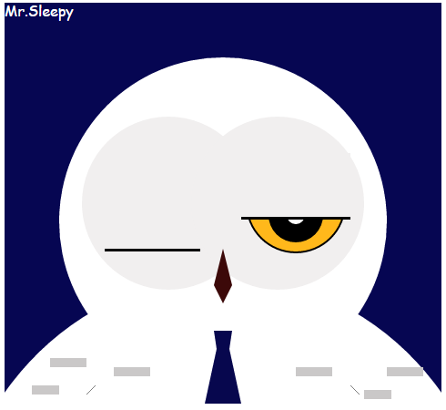
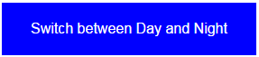
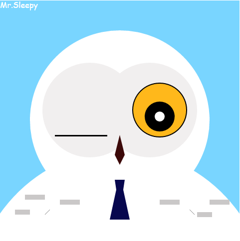

Assignment 1 - Hello World: GitHub and d3  
===
## Author
Xiaojun Wang

## Github Username
biymon

## Working Link
https://biymon.github.io/01-ghd3/index.html

## Description
This page is an snowy owl, Mr.Sleepy. He always close his eyes during the night since he always sleepy. But most of the owls are nocturnal animals. I want to show this snowy owl's habitat to users. 

I created a series shapes such as circle, polygons, lines, ellipses and rectangles to draw a snowy owl.

Users can press the button at the bottom to switch between day and night, then Mr.Sleepy can decide to sleep or wake up!
 

- sleep:
 
- wakeup:

## Technical Achievement
- Centered the svg element. 
- Created different svg shapes and customized them through d3.
- Builded data sets and binded them with DOM elements through d3 selection methods.
- Selection methods are same as javascript, such as select all elements which class attirbute is "eyelids", use ".eyelids" as selector.
- Implemented animation through d3 transiton methods.

## Design Achievement
- Drawed a snowy owl. We don't have to create large numbers bitmaps files in different solutions.
- Snowy Owl doesn't has a nocturnal habit.

## Reference
- [Understand Enter,Update and Exit in d3](https://medium.com/@c_behrens/enter-update-exit-6cafc6014c36#.s95kh9wn8)
- [How to center a svg element](http://stackoverflow.com/questions/8639383/how-do-i-center-an-svg-in-a-div)
- [SVG tags](http://www.w3schools.com/graphics/svg_intro.asp)
- [API - d3 seletion](https://github.com/d3/d3-selection)
- [API - d3 transition](https://github.com/d3/d3-transition)

